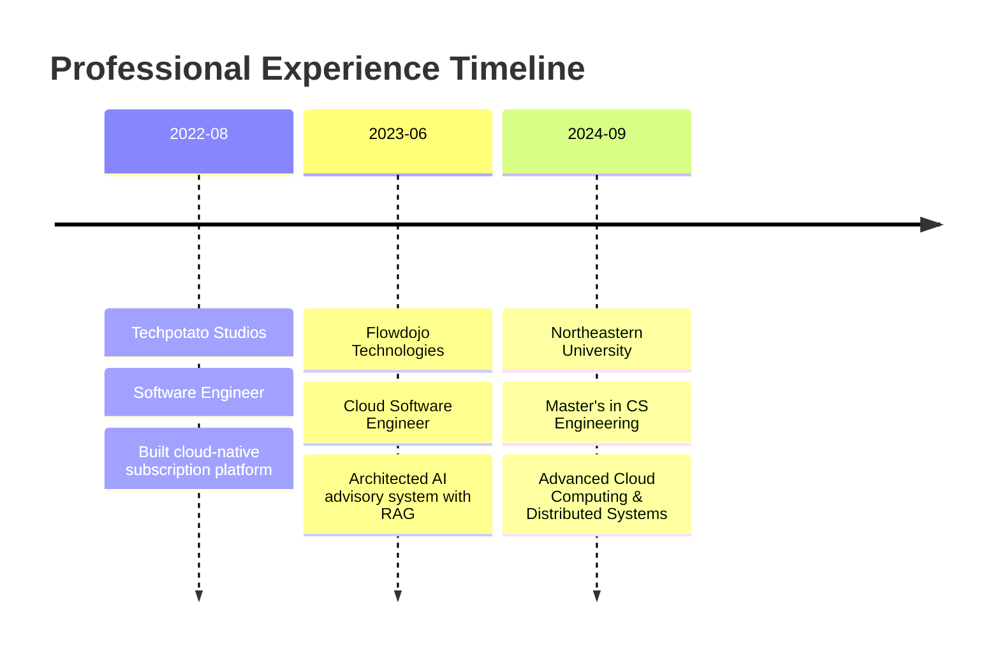

#  Hey there, I'm Yash Saraf!

  

  
  
  
  
  
  

 

  

---

## 🎯 About Me

- 🔭 Currently working on **AI-powered academic advisory systems** with RAG architecture
- 🌱 Deep diving into **AWS Solutions Architecture** & **Kubernetes Operators**
- 👯 Looking to collaborate on **Cloud-Native** and **DevOps** projects
- 💬 Ask me about **Microservices, Kubernetes, AWS, CI/CD, Go, Python**
- 📫 Reach me at **saraf.y@northeastern.edu**
- ⚡ Fun fact: **I automate everything - even my coffee maker runs on a Kubernetes CronJob! ☕**

 

---

## 🚀 Professional Journey

<b>💼 Click to expand my experience timeline</b>

### **Cloud Software Engineer @ Flowdojo Technologies** *(June 2023 - August 2024)*
> 🏆 **Key Achievement:** Reduced manual data handling by 80% through microservices automation

- 🤖 Built **AI-powered RAG system** analyzing 1000+ academic surveys with 90% relevance accuracy
- ☸️ Architected **event-driven microservices** on AWS EKS with Kafka, Go, and Python
- 🔧 Created **custom Kubernetes Operator** in Go for automated RDS backups to S3
- 📊 Implemented **enterprise observability** with Prometheus, Grafana, and Istio service mesh
- 🚀 Achieved **99.9% uptime SLA** and 50% faster incident resolution

### **Software Engineer @ Techpotato Studios** *(August 2022 - May 2023)*
> 🏆 **Key Achievement:** Reduced deployment time by 80% through CI/CD automation

- 🔐 Built **secure multi-tenant REST APIs** with Spring Boot and AWS Cognito
- 🏗️ Automated **AWS infrastructure** using Terraform and Packer
- 📨 Implemented **event-driven billing** system with Amazon SNS
- 📈 Integrated **Dynatrace OneAgent SDK** for E2E performance tracing

---

## 💻 Featured Projects

<table>
  <tr>
    <td width="50%">
      <h3 align="center">🌩️ AutoCloud Microservices</h3>
      

        
          
        

          
          
          
        

        
<strong>Cloud-native platform with 8+ RESTful APIs, serverless email verification, and 99% deployment success rate</strong>

      

    </td>
    <td width="50%">
      <h3 align="center">📊 MarketPulse Microservice</h3>
      

        
          
        

          
          
          
        

        
<strong>Real-time market data backend with FastAPI, Kafka streaming, and automated CI/CD</strong>

      

    </td>
  </tr>
  <tr>
    <td width="50%">
      <h3 align="center">🚗 AdOnWheels WebApp</h3>
      

        
          
        

          
          
          
        

        
<strong>Mobile-responsive ad platform with OAuth2.0, JWT auth, 24 RESTful APIs, and real-time WebSocket updates</strong>

      

    </td>
    <td width="50%">
      <h3 align="center">🏥 HealthNet Platform</h3>
      

        
          
        

          
          
          
        

        
<strong>Healthcare management system with RBAC, SMS/Email notifications, and PDF report generation</strong>

      

    </td>
  </tr>
</table>

---

## 🛠️ Tech Stack & Tools

### 💻 Languages & Frameworks

### ☁️ Cloud & DevOps

### 🗄️ Databases & Message Queues

### 📊 Monitoring & Observability

### 🚀 Backend Frameworks

### 🎨 Frontend

---

## 📈 GitHub Analytics

  
  

---

## 🏆 Achievements & Certifications

### 🎓 Education
- **Master's in Computer Software Engineering** - Northeastern University *(Expected May 2026)*
- **Bachelor's in Computer Science** - Maharaja Chhatrasal Bundelkhand University *(2022)*

### 📜 Currently Pursuing
- 🌟 **AWS Certified Solutions Architect - Associate**
- 🌟 **Certified Kubernetes Administrator (CKA)**

### 🏅 Key Achievements
- 📊 **80% reduction** in manual data handling through microservices automation
- 🚀 **70% faster** deployments with optimized CI/CD pipelines
- 💯 **99.9% uptime SLA** achieved with enterprise observability stack
- 🎯 **90% relevance accuracy** in AI-powered RAG system

---

## 📊 Contribution Graph

  

---

## 🤝 Let's Connect!

  
  

    <i>I'm always excited to collaborate on innovative projects and discuss cloud architecture, DevOps practices, or anything tech!</i>
  

  
  
  
    
  
  
  

---

  

